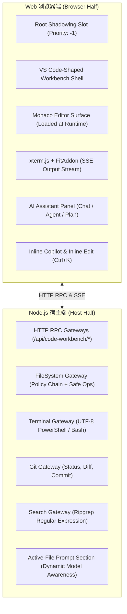

# 🚀 DeepSeek Harness Code Workbench (`dsh-code-workbench`)

> **Next-Generation Web-Native AI IDE Plugin for [DeepSeek Harness](https://github.com/deepseek-ai/deepseek-harness)**  
> 专为 DeepSeek Harness 打造的轻量级 Web-Native AI 编程工作台，带来对标 VS Code + Cursor 的下一代 AI 结对编程体验。

[](https://github.com/deepseek-ai/deepseek-harness)
[](https://opensource.org/licenses/Apache-2.0)
[](https://www.typescriptlang.org/)
[](https://microsoft.github.io/monaco-editor/)

---

## 🌟 核心特性亮点 (Key Features)

### 🎨 1. VS Code 经典 1:1 工作台架构 (VS Code-Shaped Shell)
- **六大经典区域**：
  - **活动栏 (Activity Bar)**：快速切换资源管理器、全局搜索、源代码管理、设置中心与 AI 助手；
  - **侧边栏 (Primary Sidebar)**：支持折叠/展开、宽度自由拖拽与双击复位；
  - **Monaco 代码编辑区 (Editor Tabs)**：支持多标签页管理、预览/固定标签、脏状态标记、代码折叠、Minimap 缩略图；
  - **AI 智能辅助栏 (Auxiliary Bar)**：Cursor 风格右侧常驻 AI 助手面板，支持自由停靠与展开；
  - **多标签终端面板 (Bottom Panel)**：支持底部/侧边停靠、全屏最大化、终端与问题诊断切换；
  - **状态栏 (Status Bar)**：提供 Git 分支、文件编码、行列位置、缩进切换与模式切换开关。
- **全功能文件树**：支持新建文件/文件夹、重命名、删除与右键上下文菜单。
- **全局极速检索**：集成 Ripgrep 全局代码正则搜索与结果树快速定位。

### 🤖 2. Cursor 级原生 AI 编程体验 (Cursor-Grade AI Native)
- **DeepSeek Agent 深度集成**：支持普通对话 (`Chat`)、自主编程智能体 (`Agent`) 与多步架构规划 (`Plan`) 模式。
- **行内极速代码补全 (Ghost-Text Copilot)**：按下 `Alt + \` 毫秒级浮现灰色预测实现，按 `Tab` 一键采纳。
- **选区原地重构 (Inline Edit)**：选中代码按下 `Ctrl + K`，输入自然语言需求即刻原地重构。
- **AI 智能上下文引用 (`@` Mentions)**：在 AI 对话框键入 `@` 自动联想，快速挂载 `@Terminal` 输出、`@Problems` 报错诊断或指定工程文件。
- **动态大纲与面包屑 (Document Symbols)**：自动提取 Python、TypeScript/JS、Rust、Go、Markdown 的函数、类与标题大纲。

### ⚡ 3. 闭环运行与调试体系 (Execution & Process Control)
- **一键运行代码 (`▶ Run` / `F5`)**：智能自适应工作区根目录，自动生成并执行 Python、Node.js、Rust、Go 脚本。
- **一键终止进程 (`⏹ Stop` / `Shift + F5`)**：向运行中的终端注入 `^C` (SIGINT)，安全终止死循环脚本或常驻 Web 服务。
- **终端报错一键“AI 智能修复” (`⚡ Fix with AI`)**：终端发生 Traceback 或运行报错时，自动点亮修复按钮，点击一键唤起 DeepSeek 自动定位并修改代码！
- **代码跳转到定义 (`F12` / `Ctrl + Click`)**：基于轻量符号索引，毫秒级跨文件跳转到函数与类的定义位置。
- **磁盘文件实时热重载 (On-Disk Auto-Sync)**：AI 写入或外部修改文件后，编辑器无感自动热刷新，告别手动刷新网页。

---

## 🏗️ 系统架构设计 (Architecture)

`dsh-code-workbench` 采用 DeepSeek Harness 官方推崇的 **Cordis 插件与 Bundle 规范**，实现无侵入、可拔插设计：



1. **双端解耦 (Host + Browser)**：Node 端承载安全受控的文件/终端/Git 网关，浏览器端承载 Monaco 与全功能工作台；
2. **零侵入与平滑回退**：安装后在右上角提供一键切换开关，关闭时 100% 恢复原生 Harness 对话界面；
3. **纯 Web 无 C++ 原生编译依赖**：基于标准管道流与 SSE 通信，跨平台零编译报错。

---

## 📦 安装与使用指南 (Installation & Usage)

### 环境要求
- [DeepSeek Harness](https://github.com/deepseek-ai/deepseek-harness) (`dsh --profile web`)
- Node.js `^22.19 || >=24`
- pnpm `^9.0`

### 方式 1：通过 GitHub 仓库一键安装（推荐）

```bash
dsh plugin --profile web add git+https://github.com/JUEMING-006/dsh-code-workbench.git
```

### 方式 2：离线 Tarball 压缩包安装

```bash
# 1. 在项目目录下打包
pnpm install && pnpm run build
pnpm pack

# 2. 在任意设备上一键安装
dsh plugin --profile web add ./dsh-code-workbench-0.1.0.tgz
```

### 方式 3：本地目录安装

```bash
dsh plugin --profile web add ./dsh-code-workbench
```

### 启动工作台

```bash
dsh web
```
启动后在浏览器打开 `http://127.0.0.1:3080`，点击右上角模式切换按钮即可进入沉浸式编码工作台！

---

## ⌨️ 快捷键速查表 (Keyboard Shortcuts)

| 快捷键 | 功能描述 |
| :--- | :--- |
| **`F5`** | 一键运行当前活跃文件 (Run Active File) |
| **`Shift + F5`** | 终止当前终端运行的进程 (Stop Process) |
| **`Alt + \`** | 触发行内 AI 代码预测补全 (Trigger Copilot) |
| **`Tab`** | 采纳行内 AI 补全代码 (Accept Completion) |
| **`Ctrl + K`** (Mac: `Cmd + K`) | 选区原地 AI 智能重构 (Inline Edit) |
| **`F12`** / **`Ctrl + Click`** | 跳转到函数/类定义处 (Go to Definition) |
| **`Ctrl + P`** | 快速打开文件 (Quick Open Files) |
| **`Ctrl + Shift + P`** | 打开全局命令面板 (Command Palette) |
| **`Ctrl + S`** | 保存当前文件 (Save File) |
| **`@`** (在 AI 输入框中) | 智能挂载终端、问题列表或指定文件上下文 |

---

## 🛠️ 本地开发与测试 (Development)

```bash
# 安装依赖
pnpm install

# 类型检查
pnpm run typecheck

# 运行全量单元测试 (44 test suites, 307 tests)
pnpm run test

# 生产环境编译构建
pnpm run build
```

---

## 📄 开源协议 (License)

本项目基于 [Apache-2.0 License](LICENSE) 许可协议开源。
